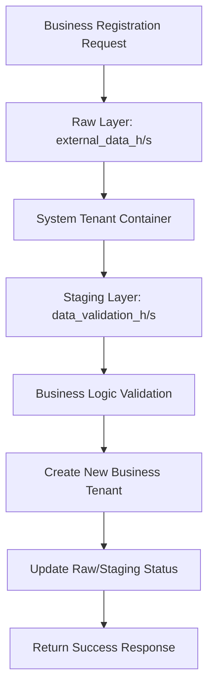

# 🏗️ System Operations Tenant Architecture

## Executive Summary

The System Operations Tenant is a foundational architectural component that provides a secure, isolated environment for handling system-level operations that don't belong to any specific business tenant. This design ensures clean separation of concerns, maintains data integrity, and provides a scalable foundation for enterprise operations.

## Architectural Principles

### 🎯 **Isolation-First Design**
- **Complete tenant isolation** - System operations never mix with business data
- **Clear boundaries** - Explicit separation between system and business concerns
- **Data sovereignty** - Each tenant (including system) owns its data completely

### 🔒 **Security by Design**
- **Least privilege access** - System operations have minimal required permissions
- **Audit trail** - Complete traceability of all system operations
- **Secure defaults** - All system components default to secure configurations

### 📈 **Enterprise Scalability**
- **Future-ready foundation** - Designed to support expanding system requirements
- **Performance isolation** - System operations don't impact business tenant performance
- **Resource management** - System tenant has dedicated resource allocation

## System Tenant Specification

### **Unique Identifiers**
```sql
-- System Tenant Hash Key (Fixed)
v_system_tenant_hk := '\x0000000000000000000000000000000000000000000000000000000000000001'::bytea;

-- System Tenant Business Key
tenant_bk := 'SYSTEM_OPERATIONS'
```

### **Tenant Profile Configuration**
| Property | Value | Rationale |
|----------|--------|-----------|
| `tenant_name` | "System Operations" | Clear identification |
| `is_active` | `TRUE` | Always available for system operations |
| `max_users` | `999` | Unlimited system users |
| `subscription_level` | "SYSTEM" | Special system-level subscription |
| `domain_name` | "system.onevault.internal" | Internal system domain |
| `contact_email` | "system@onevault.tech" | System administration contact |

## Use Cases & Data Flow

### 🚀 **Primary Use Case: Tenant Registration**



**Data Flow Details:**
1. **External Request** - Business registration comes via API
2. **Raw Capture** - Stored in `raw.external_data_h/s` with system tenant
3. **Validation** - Processed through `staging.data_validation_h/s`
4. **Business Logic** - Validated data creates new business tenant
5. **Audit Update** - Raw and staging records updated with completion status

### 🔧 **Secondary Use Cases**

#### **System Monitoring**
- Health check data collection
- Performance metrics aggregation
- Cross-tenant analytics (future)

#### **Administrative Operations**
- System configuration changes
- Bulk data operations
- Maintenance activities

#### **Integration Management**
- External system authentication
- API rate limiting data
- Third-party service coordination

## Data Isolation Strategy

### **Tenant-Level Isolation**
Every table in the system includes `tenant_hk` for complete data isolation:

```sql
-- Example: Raw data table structure
CREATE TABLE raw.external_data_h (
    external_data_hk BYTEA PRIMARY KEY,
    external_data_bk VARCHAR(255) NOT NULL,
    tenant_hk BYTEA NOT NULL,  -- ← Ensures tenant isolation
    load_date TIMESTAMP WITH TIME ZONE,
    record_source VARCHAR(100)
);
```

### **Query Isolation Pattern**
All queries must include tenant context:

```sql
-- ✅ CORRECT - Always filter by tenant
SELECT * FROM raw.external_data_h 
WHERE tenant_hk = v_system_tenant_hk;

-- ❌ WRONG - Never query without tenant filter
SELECT * FROM raw.external_data_h;
```

## Integration Points

### **API Layer Integration**
System operations are integrated at the API function level:

```sql
-- Example: Tenant registration function
CREATE OR REPLACE FUNCTION api.tenant_register_elt(p_request JSONB)
RETURNS JSONB AS $$
DECLARE
    -- System tenant reference (constant)
    v_system_tenant_hk BYTEA := '\x0000000000000000000000000000000000000000000000000000000000000001'::bytea;
BEGIN
    -- Use system tenant for pre-registration activities
    INSERT INTO raw.external_data_h VALUES (
        v_external_data_hk,
        'TENANT_REGISTRATION_' || timestamp_id,
        v_system_tenant_hk,  -- ← System tenant used here
        util.current_load_date(),
        util.get_record_source()
    );
    -- ... rest of logic
END;
$$;
```

### **Raw Data Layer Integration**
System operations data flows through standard raw tables:

- `raw.external_data_h/s` - External API requests (tenant registrations)
- `raw.user_input_h/s` - System admin interactions
- `raw.file_data_h/s` - System configuration files
- `raw.sensor_data_h/s` - System monitoring data

### **Staging Layer Integration**
System data processing uses standard staging tables:

- `staging.data_validation_h/s` - System data validation
- `staging.business_rule_h/s` - System business logic
- `staging.standardization_h/s` - System data formatting

## Security Architecture

### **Access Control Model**
```sql
-- System Admin User Structure
System Tenant (SYSTEM_OPERATIONS)
├── System Admin User (system.admin@onevault.com)
│   ├── Job Title: "System Administrator"
│   ├── Department: "System Operations"
│   └── Default Password: "SystemAdmin2024!@#" (must change)
└── Future System Users (expandable)
```

### **Permission Boundaries**
- **System tenant** - Can only access system-level data
- **Business tenants** - Cannot access system tenant data
- **Cross-tenant operations** - Only via system tenant with explicit authorization

### **Audit Requirements**
All system operations are fully auditable:
- **Raw layer** - Original request captured
- **Staging layer** - Validation and processing steps logged
- **Business layer** - Final outcomes recorded
- **Complete lineage** - Full data flow traceable

## Expansion Framework

### **Adding New System Operations**

1. **Identify the operation type**:
   - External integration
   - Administrative task
   - Cross-tenant analytics
   - System monitoring

2. **Choose appropriate data layer**:
   - Raw layer for external inputs
   - Staging layer for processing
   - Business layer for final storage

3. **Implement with system tenant**:
   ```sql
   -- Always use system tenant constant
   v_system_tenant_hk := '\x0000000000000000000000000000000000000000000000000000000000000001'::bytea;
   ```

4. **Follow naming conventions**:
   - Prefix functions with `system_` or `sys_`
   - Use descriptive business keys
   - Include comprehensive documentation

### **Future Enhancement Areas**

#### **System Monitoring Dashboard**
- Real-time system health metrics
- Cross-tenant performance analytics
- Resource utilization tracking

#### **Advanced Security Features**
- System-level role-based access control
- Enhanced audit reporting
- Automated security policy enforcement

#### **Cross-Tenant Analytics**
- Aggregated business intelligence
- System-wide reporting capabilities
- Performance benchmarking

#### **Integration Management**
- External system registry
- API gateway integration
- Service mesh coordination

## Implementation Guidelines

### **Development Standards**
```sql
-- Template for system operations function
CREATE OR REPLACE FUNCTION system_operation_template(p_request JSONB)
RETURNS JSONB AS $$
DECLARE
    -- Always use system tenant constant
    v_system_tenant_hk BYTEA := '\x0000000000000000000000000000000000000000000000000000000000000001'::bytea;
    -- Other variables...
BEGIN
    -- 1. Validate inputs
    -- 2. Store in raw layer with system tenant
    -- 3. Process through staging with system tenant
    -- 4. Execute business logic
    -- 5. Return standardized response
EXCEPTION
    WHEN OTHERS THEN
        -- Standard error handling
        RETURN jsonb_build_object(
            'success', false,
            'message', 'System operation failed: ' || SQLERRM,
            'error_code', 'SYSTEM_OPERATION_FAILED'
        );
END;
$$;
```

### **Testing Standards**
Every system operation must include:
- **Unit tests** - Individual function testing
- **Integration tests** - Cross-layer data flow testing
- **Security tests** - Tenant isolation verification
- **Performance tests** - System impact assessment

### **Documentation Standards**
All system operations require:
- **Function documentation** - Purpose, parameters, returns
- **Architecture documentation** - How it fits in the system
- **Usage examples** - Clear implementation guidance
- **Security implications** - Access patterns and restrictions

## Compliance & Governance

### **Data Vault 2.0 Compliance**
- **Hub-Link-Satellite pattern** - All data follows DV2.0 standards
- **Audit columns** - Complete load date tracking
- **Hash keys** - Consistent hashing for all entities
- **Business keys** - Meaningful identifiers for all records

### **HIPAA Compliance**
- **Data isolation** - Complete tenant separation
- **Audit trails** - Full activity logging
- **Access controls** - Restricted system access
- **Encryption** - Data protection at rest and in transit

### **Enterprise Governance**
- **Clear ownership** - System operations team responsibility
- **Change management** - Controlled system modifications
- **Disaster recovery** - System tenant backup and recovery
- **Performance monitoring** - System operation impact tracking

---

## Conclusion

The System Operations Tenant provides a robust, secure, and scalable foundation for system-level operations while maintaining complete isolation from business data. This architecture supports current needs while providing a clear path for future expansion and enhancement.

**Key Benefits:**
- ✅ **Clean Architecture** - Clear separation of system vs business concerns
- ✅ **Security-First** - Complete tenant isolation and audit trails
- ✅ **Scalable Foundation** - Ready for future system requirements
- ✅ **Enterprise-Ready** - HIPAA compliant and governance-friendly
- ✅ **Maintainable** - Clear patterns and comprehensive documentation 