# 🏗️ **PRODUCTION DATABASE DEPLOYMENT EXAMPLE**

This folder demonstrates **production-ready database deployment patterns** using proper migration management, testing, and rollback strategies.

## **📁 WHAT'S IN THIS FOLDER**

This example transforms a simple database script into a **production-ready migration** with all the enterprise patterns you need:

```
db_deployment_example/
├── V001__create_site_tracking_raw_layer.sql     # 🚀 IDEMPOTENT Migration
├── V001__rollback_site_tracking_raw_layer.sql   # 🔄 SAFE Rollback  
├── test_site_tracking_deployment.py             # 🧪 AUTOMATED Tests
├── deployment_checklist.md                      # 📋 MANUAL Validation
└── README.md                                     # 📖 This guide
```

---

## **🎯 KEY PATTERNS DEMONSTRATED**

### **1. IDEMPOTENT MIGRATIONS**
**Problem:** Scripts that fail when run twice
**Solution:** Everything uses `IF NOT EXISTS` patterns

```sql
-- ❌ DANGEROUS - Fails on second run
CREATE TABLE site_tracking_events_r (...);

-- ✅ SAFE - Can run multiple times
CREATE TABLE IF NOT EXISTS site_tracking_events_r (...);
```

### **2. BACKWARDS COMPATIBLE**
**Problem:** Breaking existing systems
**Solution:** Graceful dependency handling

```sql
-- ✅ BACKWARDS COMPATIBLE - Checks if dependencies exist
DO $$
BEGIN
    IF EXISTS (SELECT 1 FROM information_schema.tables WHERE table_name = 'tenant_h') THEN
        ALTER TABLE site_tracking_events_r 
        ADD CONSTRAINT fk_tenant FOREIGN KEY (tenant_hk) REFERENCES auth.tenant_h(tenant_hk);
    ELSE
        RAISE NOTICE '⚠️  Dependency not found - skipping constraint';
    END IF;
END $$;
```

### **3. ROLLBACK READY**
**Problem:** No way to undo changes
**Solution:** Complete rollback script with safety checks

```sql
-- ✅ SAFE ROLLBACK - Checks dependencies before dropping
IF NOT EXISTS (SELECT 1 FROM dependent_tables) THEN
    DROP TABLE site_tracking_events_r;
ELSE
    RAISE WARNING 'Cannot drop - dependencies exist';
END IF;
```

---

## **🔥 PRODUCTION DEPLOYMENT WORKFLOW**

### **Development → Testing → Production Pipeline**

```mermaid
graph LR
    A[Write Migration] --> B[Test Locally]
    B --> C[Peer Review]
    C --> D[Deploy to DEV]
    D --> E[Run Automated Tests]
    E --> F[Deploy to STAGING]
    F --> G[Manual Testing]
    G --> H[Deploy to PRODUCTION]
    
    D --> I[Rollback Test]
    F --> I
    I --> J[Rollback Ready ✅]
```



### **How This Works in Practice:**

1. **Development Phase:**
   ```bash
   # Developer writes migration
   vim V001__create_site_tracking_raw_layer.sql
   
   # Test locally
   psql -f V001__create_site_tracking_raw_layer.sql
   python test_site_tracking_deployment.py
   
   # Test rollback
   psql -f V001__rollback_site_tracking_raw_layer.sql
   ```

2. **CI/CD Pipeline:**
   ```yaml
   # Example GitHub Actions / GitLab CI
   test_migration:
     steps:
       - run: python test_site_tracking_deployment.py
       - run: psql -f V001__create_site_tracking_raw_layer.sql
       - run: psql -f V001__rollback_site_tracking_raw_layer.sql
   ```

3. **Production Deployment:**
   ```bash
   # DBA follows checklist
   # deployment_checklist.md guides the process step-by-step
   ```

---

## **🚀 HOW TO USE THIS PATTERN**

### **Step 1: Copy the Template**
```bash
# Copy this folder structure for your migration
cp -r db_deployment_example/ V002__your_feature_name/

# Rename the files
mv V001__create_site_tracking_raw_layer.sql V002__your_feature_name.sql
mv V001__rollback_site_tracking_raw_layer.sql V002__rollback_your_feature_name.sql
```

### **Step 2: Adapt the Migration**
```sql
-- In your V002__your_feature_name.sql
INSERT INTO migrations.migration_log (version, script_name, description) VALUES (
    '002',  -- <- Update version number
    'V002__your_feature_name.sql',  -- <- Update filename
    'Description of your feature'   -- <- Update description
);

-- Replace the content with your actual migration
CREATE TABLE IF NOT EXISTS your_schema.your_table (...);
```

### **Step 3: Adapt the Rollback**
```sql
-- In your V002__rollback_your_feature_name.sql
-- Add logic to safely remove YOUR objects
DROP TABLE IF EXISTS your_schema.your_table;
```

### **Step 4: Update the Tests**
```python
# In test_your_deployment.py
def test_your_objects_created(self):
    # Test YOUR specific objects
    result = self.execute_query("SELECT COUNT(*) FROM your_schema.your_table")
    # Add YOUR validation logic
```

### **Step 5: Update the Checklist**
```markdown
# In deployment_checklist.md
- [ ] YOUR_TABLE created successfully
- [ ] YOUR_FUNCTION working correctly  
- [ ] YOUR_SPECIFIC validations passed
```

---

## **⚡ ADVANCED PATTERNS**

### **Migration Versioning**
```sql
-- Track all migrations in a central table
CREATE TABLE IF NOT EXISTS migrations.migration_log (
    version VARCHAR(10) PRIMARY KEY,
    script_name VARCHAR(255),
    description TEXT,
    applied_by VARCHAR(100),
    applied_at TIMESTAMP WITH TIME ZONE,
    completed_at TIMESTAMP WITH TIME ZONE,
    status VARCHAR(20),
    notes TEXT
);
```

### **Dependency Validation**
```sql
-- Check for required dependencies before migration
DO $$
BEGIN
    IF NOT EXISTS (SELECT 1 FROM pg_extension WHERE extname = 'uuid-ossp') THEN
        RAISE EXCEPTION 'Required extension uuid-ossp not installed';
    END IF;
END $$;
```

### **Performance-Safe Migrations**
```sql
-- Add indexes concurrently to avoid blocking
CREATE INDEX CONCURRENTLY IF NOT EXISTS idx_your_index 
ON your_table(your_column);

-- Add columns with defaults carefully
ALTER TABLE your_table ADD COLUMN IF NOT EXISTS 
new_column TEXT DEFAULT 'safe_default';
```

### **Data Migration Patterns**
```sql
-- Migrate data in batches to avoid long locks
DO $$
DECLARE
    batch_size INTEGER := 1000;
    affected_rows INTEGER;
BEGIN
    LOOP
        UPDATE your_table 
        SET new_column = transform_function(old_column)
        WHERE new_column IS NULL
        LIMIT batch_size;
        
        GET DIAGNOSTICS affected_rows = ROW_COUNT;
        EXIT WHEN affected_rows = 0;
        
        RAISE NOTICE 'Migrated % rows', affected_rows;
        COMMIT;  -- Release locks between batches
    END LOOP;
END $$;
```

---

## **🛡️ SAFETY PATTERNS**

### **Environment Detection**
```sql
-- Different behavior per environment
DO $$
BEGIN
    IF current_database() = 'production' THEN
        -- Extra cautious in production
        RAISE NOTICE 'PRODUCTION deployment - extra validation';
    ELSE
        -- More permissive in development
        RAISE NOTICE 'DEV/TEST deployment - standard validation';
    END IF;
END $$;
```

### **Rollback Safety**
```sql
-- Never drop data without backup
DO $$
BEGIN
    -- Create backup before destructive operation
    EXECUTE 'CREATE TABLE backup_' || to_char(CURRENT_DATE, 'YYYYMMDD') || 
            '_your_table AS SELECT * FROM your_table';
    
    -- Then safe to modify/drop
    DROP TABLE your_table;
END $$;
```

### **Transaction Control**
```sql
-- Wrap risky operations in transactions
BEGIN;
    -- Risky operations here
    CREATE TABLE new_table (...);
    INSERT INTO new_table SELECT * FROM old_table;
    
    -- Validate success
    DO $$
    BEGIN
        IF (SELECT COUNT(*) FROM new_table) = 0 THEN
            RAISE EXCEPTION 'Migration validation failed';
        END IF;
    END $$;
COMMIT;
```

---

## **📊 MONITORING & OBSERVABILITY**

### **Migration Metrics**
```sql
-- Track migration performance
INSERT INTO migrations.performance_log (
    version, 
    start_time, 
    end_time, 
    objects_created,
    rows_affected
);
```

### **Health Checks**
```sql
-- Post-deployment health check
SELECT 
    'raw.site_tracking_events_r' as object_name,
    CASE WHEN EXISTS(SELECT 1 FROM raw.site_tracking_events_r LIMIT 1) 
         THEN 'HEALTHY' ELSE 'EMPTY' END as status;
```

---

## **🎉 WHY THIS MATTERS**

### **Before (Dangerous Pattern):**
```sql
-- ❌ One-shot script - breaks everything
CREATE TABLE users (...);        -- Fails if table exists
ALTER TABLE users ADD COLUMN;    -- Fails if column exists  
INSERT INTO users VALUES (...);  -- Fails if data exists
-- No rollback, no testing, no validation
```

### **After (Production Pattern):**
```sql
-- ✅ Enterprise-ready migration
CREATE TABLE IF NOT EXISTS users (...);
ALTER TABLE users ADD COLUMN IF NOT EXISTS email TEXT;
INSERT INTO users (...) ON CONFLICT DO NOTHING;
-- + Complete rollback script
-- + Automated testing  
-- + Manual checklist
-- + Performance validation
-- + Security checks
```

---

## **🚀 NEXT STEPS**

1. **Use this template** for your next database migration
2. **Adapt the patterns** to your specific needs
3. **Build CI/CD integration** around these scripts
4. **Train your team** on these deployment practices
5. **Create migration standards** based on these patterns

**This is how you deploy database changes safely in production!** 🏆